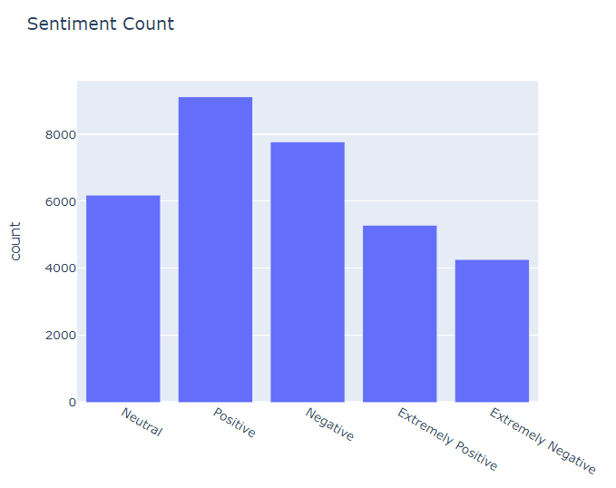

# NLP for Sentimental Analysis
## Data Taken from Covid-19 Tweets

### Links:
[Kaggle](https://www.kaggle.com/datatattle/covid-19-nlp-text-classification)

##Data Overview:
32,567 Entries

> Columns:
>>+ UserName
>>+ ScreenName
>>+ Location
>>+ TweetAt
>>+ OriginalTweet
>>+ Sentiment

## Models:

+ Bag of Words, testing with a few **Scikit-learn** classifiers, and **NLKT** for data pre-processing
+ RNN Coming Soon

## Model Overview:

`SGDClassifier` has produced our best Bag-of-words model with a 52% Accuracy.

