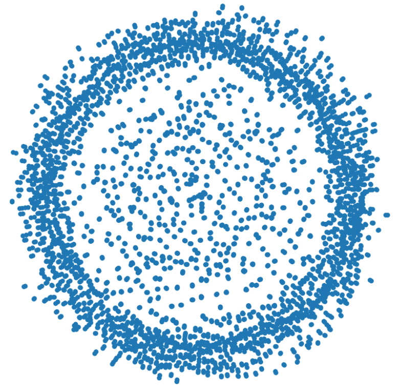
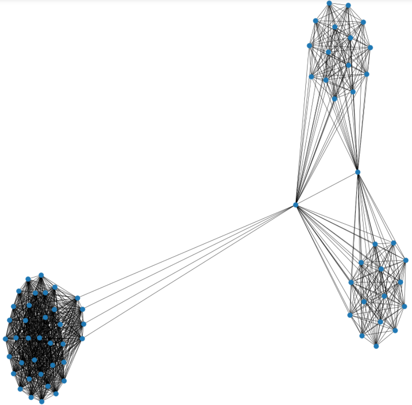

# Social Network Analysis
## Data Taken from Behance, "the world's largest creative network for showcasing and discovering creative work".

## Data Overview:
1st document contains appreciation entries, (user, item, timestamp).
2nd document contains user items, (user, item). 
10,000 Samples taken from the 2nd document.

## Models:
+ **Nodes**: item ids.
+ **Edges**: Connection is made every time two items appear in the same users collection.
+ Undirected Graph. Item ids, are both the source and target for the edge creation.

## Model Overview:

`Full Model`:
Top 5 nodes: Item number 01249687 with 7126794 degrees.
Top 4 nodes: Item number 00563452 with 7912099 degrees.
Top 3 nodes: Item number 00307044 with 8796999 degrees.
Top 2 nodes: Item number 00346488 with 8796999 degrees.
Top 1 nodes: Item number 00230615 with 9113096 degrees.

`10,000 Sample`:
**32,526,412** edges produced.

### Clusters of item groupings.

`Item: 00120154 contains: 69 edges` This is the node with highest degree in our sample.
### Cluster for Item 00120154
