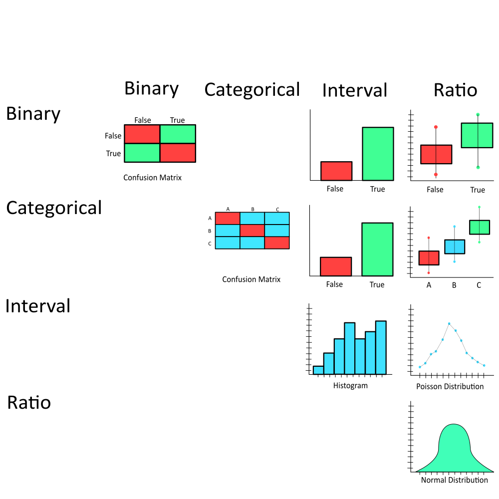

## Level of Measurement
| Incremental Progress | Mathematical Operators | Summary | Example |
| :--- | :---: | :--- | :--- |
| `Nominal`  | = , ≠ | Categorical classes.  | (0, 1) , ("Red" , "Blue" , "Green")                  |
| `Ordinal`  | > , < | Ranking order.        | (1st, 2nd, 3rd), ("Agree", "Indiferent", "Disgaree") |
| `Interval` | + , - | Degree of difference. | Temperature in Celsius, Relative Distance            |
| `Ratio`    | x , / | Continuous Quantity.  | Temperature in Kelvin, Price, Size, Income           |

## Statistical Data Types
| Data Type |  Possible Values | Example | Level of Measurement | Distribution | Regression Analysis |
| :--- | :--- | :--- | :--- | :--- | :--- |
| `Binary`                    | 0,1                       | ("Yes","No"), (True, False)                           | `Nominal`  | Bernoulli                                   | Logistic, Probit                        |
| `Categorical`               | 0, 1,...k                 | Labels                                                | `Nominal`  | Categorical                                 | Multinominal logit, Multinominal probit |
| `Oridinal`                  | Integers                  | (1st, 2nd, 3rd), ("Agree", "Indiferent", "Disgaree")  | `Ordinal`  | Categorical                                 | Ordinal Regression                      |
| `Binomial`                  | 0, 1,...N                 | Coin Flips N Times                                    | `Interval` | Binomial Distribution                       | Binomial Regression, Logistic, Probit   |
| `Count`                     | Non-Negative Integers     | Number of items, people in given interval/area/volume | `Ratio`    | Poisson Distribution                        | Poisson                                 |
| `Real-Value Additive`       | Real Numbers              | Temperature in Celsius, Relative Distance             | `Interval` | Normal Distribution                         | OLS
| `Real-Value Multiplicative` | Non-negative Real Numbers | Temperature in Kelvin, Price, Size, Income            | `Ratio`    | Log-normal Distribution, Gamma, Exponential | GLM with Logarithmic Link               |

## Matrix

